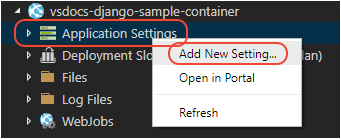

# Deploy the image to Azure App Service

With an image built and pushed to a registry, you can use the Docker extension in VS Code to easily set up an Azure App Service running the container.

1. In the **Docker** explorer, expand **Registries** > **Azure**, then expand your registry node and the image name until you see the image with the `:latest` tag.

    

1. Right-click the image and select **Deploy Image to Azure App Service**.

    

1. Follow the prompts to select an Azure subscription, select or specify a resource group, specify a region, configure an App Service Plan (B1 is the least expensive), and specify a name for the site. The animation below illustrates the process.

    

    A **Resource Group** is a named collection the different resources that make up an app. By assigning all the app's resources to a single group, you can easily manage those resources as a single unit. (For more information, see the [Azure Resource Manager overview](https://docs.microsoft.com/azure/azure-resource-manager/resource-group-overview) in the Azure documentation.)

    An **App Service Plan** defines the physical resources (an underlying virtual machine) that hosts the running container. For this tutorial, B1 is the least expensive plan that supports Docker containers. (For more information, see [App Service plan overview](https://docs.microsoft.com/azure/app-service/azure-web-sites-web-hosting-plans-in-depth-overview) in the Azure documentation.)

    The name of the App Service must be unique across all of Azure, so you typically use a company or personal name. For production sites, you typically configure the App Service with a separately-registered domain name.

1. Creating the app service takes a few minutes, and you see progress in VS Code's Output panel.

1. Once completed, you must also add a setting named `WEBSITES_PORT` to the App Service to specify the port on which the container is listening, such as 3000, 8000, 5555. To do this, switch to the **Azure: App Service** explorer, expand the node for your new App Service (refresh if necessary), then right-click **Application Settings** and select **Add New Setting**. At the prompts enter `WEBSITES_PORT` as the key and the port number for the value.

    

1. Right-click the App Service and select **Restart** to apply the setting.

1. After the service has restarted, browse the site at `http://<name>.azurewebsites.net`. You can `kbstyle(Ctrl+click)` the URL in the Output panel, or right-click the App Service in the **Azure: App Service** explorer and select **Browse Website**.

## Redeploying after changes

Because you inevitably make changes to your app, you'll also be rebuilding and redeploying your container many times. Fortunately, the process is very simple:

1. Make changes to your app and test locally.

1. Rebuild the Docker image. If you change only app code, the build should take only a few seconds.

1. Push your image to the registry. If again you change nothing but app code, only that small layer needs to be pushed and the process typically completes in a few seconds.

1. In the **Azure: App Service** explorer, right-click the appropriate App Service and select **Restart**. Restarting an app service automatically pulls the latest container image from the registry.

1. After about 15-20 seconds, visit the App Service URL again to check the updates.

----

<a class="tutorial-next-btn" href="/tutorials/docker-extension/tailing-logs">My site is on Azure</a> <a class="tutorial-feedback-btn" onclick="reportIssue('docker-extension', 'deploy-app')" href="javascript:void(0)">I ran into an issue</a>
