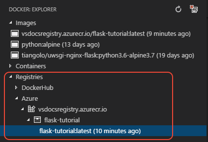
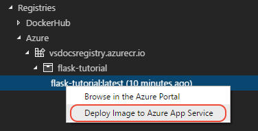

# Deploy the image to Azure App Service

With an image built and pushed to a registry, you can use the Docker extension in VS Code to easily deploy that image to Azure App Service.

[Azure App Service](https://azure.microsoft.com/services/app-service/)

1. In the **Docker** explorer, expand **Registries** > **Azure**, the expand your registry node and the image name until you see the image with the `:latest` tag.

    

1. Right-click the image and select **Deploy Image to Azure App Service**.

    

1. Follow the prompts to select an Azure subscription, select or specify a resource group, specify a region, configure an App Service Plan (B1 is the least expensive), and specify a name for the site, which must be unique across Azure, so it's helpful to include company or personal names. The animation below illustrates the process.

    

    A **Resource Group** is a named collection the different resources that make up an app. By assigning all the app's resources to a single group, you can easily manage those resources as a single unit. (For more information, see the [Azure Resource Manager overview](https://docs.microsoft.com/azure/azure-resource-manager/resource-group-overview) in the Azure documentation.)

    An **App Service Plan** defines the physical resources (an underlying virtual machine) that hosts the running container. For this tutorial, B1 is the least expensive plan that supports Docker containers. (For more information, see [App Service plan overview](https://docs.microsoft.com/azure/app-service/azure-web-sites-web-hosting-plans-in-depth-overview) in the Azure documentation.)

1. VS Code's Output panel shows deployment progress.

1. Once completed, browse the site at `http://<name>.azurewebsites.net`. You can `kbstyle(Ctrl+click)` the URL in the Output panel, or in the **Azure: App Service** explorer, refresh, then locate the App Service, right-click, and select **Browse Website**.

----

<a class="tutorial-next-btn" href="/tutorials/docker-extension/tailing-logs">My site is on Azure</a> <a class="tutorial-feedback-btn" onclick="reportIssue('docker-extension', 'deploy-app')" href="javascript:void(0)">I ran into an issue</a>
