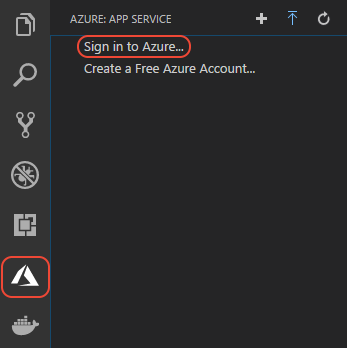

# Deploy to Azure using Docker

This tutorial walks you through containerizing an existing Node.js or Python application using [Docker](https://www.docker.com/), pushing the app image to a Docker registry, then deploying the image to [Azure Web App for Containers](https://azure.microsoft.com/services/app-service/containers/) directly from Visual Studio Code.

## A brief introduction to containers

Docker is a system that allows you to deploy and run apps using *containers* rather than setting up dedicated environments like virtual machines. A container is a lightweight runtime environment that shares the resources of the host operating system with other containers. Docker provide the layer that sits on top of the operating system to manages those resources on behalf of containers.

A container is specifically an instance of a Docker *image*, which is an executable package that contains everything needed to run your app: the app code, configuration files, the necessary runtimes, and all of app's dependencies. A container image can be used to create any number of identical containers, which makes them especially useful when scaling out a cloud-based web app. Because container images are much smaller than virtual machine images, instances can be started and stopped much more quickly than virtual machines, enabling your app to be highly responsive to varying loads at a minimal cost.

Images are also built in multiple *layers* using base images that contain common elements like the Node.js and Python runtimes. As a result, it takes very little time to rebuild an image after making a change to you app code, which is only the top layer. Similarly, when you push an image to a container registry, from which it can be deployed to the cloud, only that modified layer needs to be uploaded and redeployed. This layering means that using containers doesn't impose a significant penalty to your inner develop-test-deploy loop.

You experience the basics of containers and images in this tutorial. For additional background, refer to the [Docker documentation](https://docs.docker.com/get-started/).

## Prerequisites

To complete this tutorial you need an Azure account, Docker, Visual Studio Code with , a Node.js or Python environment, and an app that you'd like to deploy using containers.

### Azure account

If you don't have an Azure account, [sign up now](https://azure.microsoft.com/free/?utm_source=campaign&utm_campaign=vscode-tutorial-docker-extension&mktingSource=vscode-tutorial-docker-extension) for a free 30-day account with $200 in Azure credits to try out any combination of services.

### Visual Studio Code, Docker, and language runtime

Install the following:

- [Visual Studio Code](https://code.visualstudio.com/).

- [Docker Community Edition](https://www.docker.com/community-edition).

- A suitable Node.js or Python environment:
  - [Node.js and npm](https://nodejs.org/en/download), or
  - Python and the Python extension as described on [Python Tutorial - Prerequisites](../../docs/python/python-tutorial.md).

### Docker and Azure App Service extensions

The **Docker extension** helps you manage local Docker images, provides Docker commands, and simplifies deployment of app images to Azure.

> <a class="tutorial-install-extension-btn" href="vscode:extension/PeterJausovec.vscode-docker">Install the Docker extension</a>

You can find an overview of the extension on the [vscode-docker GitHub repository](https://github.com/Microsoft/vscode-docker).

The **Azure App Service extension** helps you create, manage, and deploy Web Apps to Azure App Service on Linux.

> <a class="tutorial-install-extension-btn" href="vscode:extension/ms-azuretools.vscode-azureappservice">Install the Azure App Service extension</a>

For details, explore the [App Service extension tutorial](../app-service-extension/getting-started.md) visit the [vscode-azureappservice GitHub repository](https://github.com/Microsoft/vscode-azureappservice).

### Sign in to Azure

Once the extensions are installed, log into your Azure account by navigating to the **Azure: App Service** explorer, select **Sign in to Azure**, and follow the prompts.



### App code

If you don't already have an app you'd like to work with, use one of the following:

- Node.js: follow the [Node.js tutorial](/docs/nodejs/nodejs-tutorial.md).

- Python: use either of the following samples, which already include the Docker-related files described in a later step of thus tutorial:

  - The [python-sample-vscode-django-tutorial](https://github.com/Microsoft/python-sample-vscode-django-tutorial) sample, which is the result of following the [Django Tutorial](../../python/tutorial-django.md).

  - The [python-sample-vscode-flask-tutorial](https://github.com/Microsoft/python-sample-vscode-flask-tutorial) sample, which is the result of following the [Flask Tutorial](../../python/tutorial-flask.md).

## Prerequisite check

Before continuing, verify the following:

1. Build and run your app code locally on your computer, installing any packages on which your app depends. For Python apps, also generate a `requirements.txt` file using `pip freeze` (which are included in the samples) so that those dependencies can be automatically installed in the Docker image.

1. To verify Docker, run the command below, which should show output such as `Docker version 18.06.1-ce, build e68fc7a`.

    ```bash
    docker --version
    ```

1. In VS Code, verify that you see the email account of your Azure around in the Status Bar and your subscription(s) in the **Azure: App Service** explorer.

    

    

----

<a class="tutorial-next-btn" href="/tutorials/docker-extension/create-registry">I've installed the extensions</a>
<a class="tutorial-feedback-btn" onclick="reportIssue('docker-extension', 'getting-started')" href="javascript:void(0)">I ran into an issue</a>
