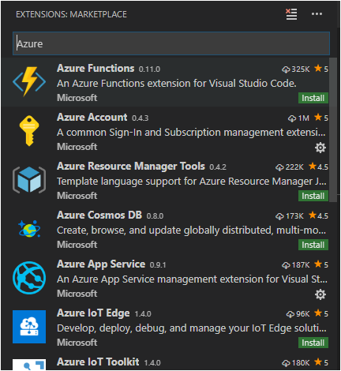

# Viewing Logs

In this step, you learn how to view (or "tail") the logs from the running website. Any calls that output to the control, such as `print` in Python and `console.log` in Node.js, are displayed in the Output panel in Visual Studio Code.

1. Find the app in the **Azure: App Service** explorer, right-click the app, and choose **Start Streaming Logs**.

1. Answer **Yes** when prompted to enable logging and restart the app. Once the app is restarted, the VS Code Output panel opens with a connection to the log stream.

1. After a few seconds, you see a message indicating that you are connected to the log-streaming service.

    ```bash
    Connecting to log stream...
    2018-09-27T20:14:26  Welcome, you are now connected to log-streaming service.

    2018-09-27 20:14:59.269 INFO  - Starting container for site

    2018-09-27 20:14:59.270 INFO  - docker run -d -p 24138:8000 --name vsdocs-django-sample-container_0 -e WEBSITES_PORT=8000 -e WEBSITE_SITE_NAME=vsdocs-django-sample-container -e WEBSITE_AUTH_ENABLED=False -e WEBSITE_ROLE_INSTANCE_ID=0 -e WEBSITE_INSTANCE_ID=02c705ae24eaf5f298e553a9c2724b9fe4485707c2d1c36137cd02931091e561 -e HTTP_LOGGING_ENABLED=1 vsdocsregistry.azurecr.io/python-sample-vscode-django-tutorial:latest

    2018-09-27 20:15:06.216 INFO  - Container vsdocs-django-sample-container_0 for site vsdocs-django-sample-container initialized successfully.
    ```

    Navigate within the app to see additional output for various HTTP requests.

## Congratulations!

Congratulations, you've successfully completed this walkthrough!

## Learn more at docs.microsoft.com

The [Azure for Node.js](https://docs.microsoft.com/en-us/nodejs/azure/?view=azure-node-2.0.0) developer center on [docs.microsoft.com](https://docs.microsoft.com) has a number of great articles on how to build and deploy Node.js based functions and applications to Azure.

The [Azure Python Developer Center](https://docs.microsoft.com/en-us/python/azure/?view=azure-python) also has many resources for working with various Azure services from Python, including data storage and AI and Machine Learning services.

## Other Azure extensions for VS Code

There are many other Azure extensions for VS Code. Just search on "Azure" in the Extensions explorer:



A few favorites include:

- [Cosmos DB](https://marketplace.visualstudio.com/items?itemName=ms-azuretools.vscode-cosmosdb)
- [Azure Functions](https://marketplace.visualstudio.com/items?itemName=ms-azuretools.vscode-azurefunctions)
- [Azure CLI Tools](https://marketplace.visualstudio.com/items?itemName=ms-vscode.azurecli)
- [Azure Resource Manager (ARM) Tools](https://marketplace.visualstudio.com/items?itemName=msazurermtools.azurerm-vscode-tools)

A collection of Azure extensions can be installed togehter by installing the [Azure Tools](https://marketplace.visualstudio.com/items?itemName=ms-vscode.vscode-node-azure-pack) extension pack.

----

<a class="tutorial-next-btn" href="/docs">I'm Done!</a> <a class="tutorial-feedback-btn" onclick="reportIssue('docker-extension', 'tailing-logs')" href="javascript:void(0)">I ran into an issue</a>
